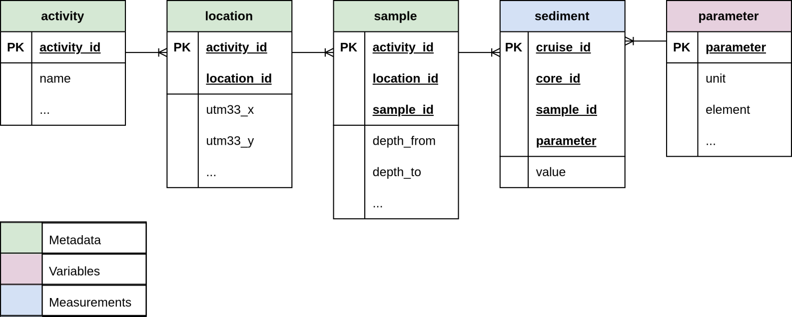

The page shows the database schema diagram along with table definitions based on the Vannmilijø dataset.

## DB Schema Diagram
The proposed database design shown in the ER (Entity Relationship) diagram below contains 10 tables including three meta (entity) tables, four variable (look-up or reference) tables, one fact (measurement) table, and two mixed tables.

The columns with `PK` in the diagram indicate primary keys of the table, which guarantees unique identifications.

{.zoomable}

## Activity Table

The `activity` table contains the monitoring programs or projects associated with the samples.

### Table Columns
```{r}
library(tibble)

activity_tbl <- tibble(
  `Name` = c(
    "activity_id", "activity_name"
  ),
  `Data Type` = c(
    "TEXT", "TEXT"
  ),
  `PK` = c(
    "✓", ""
  ),
  `NA Allowed` = c(
    FALSE, FALSE
  ),
  `Description` = c(
    "Primary Key. Unique identifier for the activity/monitoring program.",
    "Name of the monitoring program or project."
  )
)

activity_tbl
```

## Client Table

The `client` table stores information about the entities (e.g., municipalities, environmental agencies) that commissioned the data collection.

### Table Columns
```{r}
client_tbl <- tibble(
  `Name` = c(
    "client_id", "client", "archive"
  ),
  `Data Type` = c(
    "INTEGER", "TEXT", "BOOLEAN"
  ),
  `PK` = c(
    "✓", "", ""
  ),
  `NA Allowed` = c(
    FALSE, FALSE, FALSE
  ),
  `Description` = c(
    "Primary Key. Unique identifier for the client.",
    "Name of the client or commissioner.",
    "Flag indicating if the record is archived."
  )
)

client_tbl
```

## Contractor Table

The `contractor` table identifies the laboratories or institutes that performed the sampling or analysis.

### Table Columns
```{r}
contractor_tbl <- tibble(
  `Name` = c(
    "contractor_id", "contractor"
  ),
  `Data Type` = c(
    "INTEGER", "TEXT"
  ),
  `PK` = c(
    "✓", ""
  ),
  `NA Allowed` = c(
    FALSE, FALSE
  ),
  `Description` = c(
    "Primary Key. Unique identifier for the contractor.",
    "Name of the contractor (e.g., NIVA, Analycen)."
  )
)

contractor_tbl
```

## Site Table

The `site` table holds geographical and administrative details about the sampling locations.

### Table Columns
```{r}
site_tbl <- tibble(
  `Name` = c(
    "site_code", "site_name", "label", "lon",
    "lat", "dist_to_coast", "country", "country_code",
    "municipality", "sea_name"
  ),
  `Data Type` = c(
    "TEXT", "TEXT", "TEXT", "REAL",
    "REAL", "REAL", "TEXT", "TEXT",
    "TEXT", "TEXT"
  ),
  `PK` = c(
    "✓", "", "", "",
    "", "", "", "",
    "", ""
  ),
  `NA Allowed` = c(
    FALSE, TRUE, TRUE, FALSE,
    FALSE, TRUE, TRUE, TRUE,
    TRUE, TRUE
  ),
  `Description` = c(
    "Primary Key. Unique code for the sampling site.",
    "Name of the sampling location.",
    "Additional designation or label for the site.",
    "Longitude coordinate.",
    "Latitude coordinate.",
    "Distance to the coast.",
    "Country name.",
    "Country code (e.g., NO).",
    "Municipality name.",
    "Name of the sea or coastal water body."
  )
)

site_tbl
```

## Sample Method Table

The `sample_method` table catalogs the different techniques and equipment used to collect samples.

### Table Columns
```{r}
sample_method_tbl <- tibble(
  `Name` = c(
    "method_id", "method"
  ),
  `Data Type` = c(
    "INTEGER", "TEXT"
  ),
  `PK` = c(
    "✓", ""
  ),
  `NA Allowed` = c(
    FALSE, FALSE
  ),
  `Description` = c(
    "Primary Key. Unique identifier for the sampling method.",
    "Description or standard code for the sampling method."
  )
)

sample_method_tbl
```

## Analysis Method Table

The `analysis_method` table contains the laboratory procedures and units used to analyze the parameters.

### Table Columns
```{r}
analysis_method_tbl <- tibble(
  `Name` = c(
    "analysis_id", "analysis", "unit"
  ),
  `Data Type` = c(
    "INTEGER", "TEXT", "TEXT"
  ),
  `PK` = c(
    "✓", "", ""
  ),
  `NA Allowed` = c(
    FALSE, FALSE, FALSE
  ),
  `Description` = c(
    "Primary Key. Unique identifier for the analysis method.",
    "Description or standard code of the analysis method.",
    "Unit of measurement for the analysis results."
  )
)

analysis_method_tbl
```

## Parameter Table

The `parameter` table defines the chemicals or properties being measured.

### Table Columns
```{r}
parameter_tbl <- tibble(
  `Name` = c(
    "param_id", "param_name", "cas_no"
  ),
  `Data Type` = c(
    "TEXT", "TEXT", "TEXT"
  ),
  `PK` = c(
    "✓", "", ""
  ),
  `NA Allowed` = c(
    FALSE, FALSE, TRUE
  ),
  `Description` = c(
    "Primary Key. Unique code for the parameter.",
    "Name of the chemical or measured property.",
    "Chemical Abstracts Service (CAS) registry number."
  )
)

parameter_tbl
```

## Sample Table

The `sample` table records the core metadata for each physical sample collected, tying together locations, methods, and actors.

### Table Columns
```{r}
sample_tbl <- tibble(
  `Name` = c(
    "sample_id", "activity_id", "site_code", "client_id", 
    "contractor_id", "method_id", "upper_depth", "lower_depth", 
    "sample_time", "filtered"
  ),
  `Data Type` = c(
    "TEXT", "TEXT", "TEXT", "INTEGER",
    "INTEGER", "INTEGER", "REAL", "REAL",
    "TEXT", "BOOLEAN"
  ),
  `PK` = c(
    "✓", "", "", "",
    "", "", "", "",
    "", ""
  ),
  `NA Allowed` = c(
    FALSE, FALSE, FALSE, FALSE,
    FALSE, FALSE, FALSE, FALSE,
    TRUE, TRUE
  ),
  `Description` = c(
    "Primary Key. Unique identifier for the sample.",
    "Foreign Key to activity table.",
    "Foreign Key to site table.",
    "Foreign Key to client table.",
    "Foreign Key to contractor table.",
    "Foreign Key to sample_method table.",
    "Upper depth of the sample.",
    "Lower depth of the sample.",
    "Timestamp of when the sample was collected.",
    "Indicates whether the sample was filtered."
  )
)

sample_tbl
```

## Sediment Table

The `sediment` table stores the actual measurement values for the parameters analyzed in each sample. 

### Table Columns
```{r}
sediment_tbl <- tibble(
  `Name` = c(
    "sample_id", "param_id", "sediment_no", "analysis_id",
    "value", "operator", "sample_no", "n_values"
  ),
  `Data Type` = c(
    "TEXT", "TEXT", "INTEGER", "INTEGER",
    "REAL", "TEXT", "TEXT", "INTEGER"
  ),
  `PK` = c(
    "✓", "✓", "✓", "",
    "", "", "", ""
  ),
  `NA Allowed` = c(
    FALSE, FALSE, FALSE, FALSE,
    FALSE, TRUE, TRUE, TRUE
  ),
  `Description` = c(
    "Primary Key. Foreign Key to sample table.",
    "Primary Key. Foreign Key to parameter table.",
    "Primary Key. Sequential index for multiple records per sample-parameter combination.",
    "Foreign Key to analysis_method table.",
    "The measured concentration or numerical result.",
    "Mathematical operator (e.g., <, =, >), indicating LLD.",
    "Physical sample identification number.",
    "Number of values/replicates used to derive the measurement."
  )
)

sediment_tbl
```

## LLD (Limits of Detection) Table

The `lld` table contains Limit of Detection (LOD) and Limit of Quantification (LOQ) data corresponding to specific measurements.

### Table Columns
```{r}
lld_tbl <- tibble(
  `Name` = c(
    "sample_id", "param_id", "sediment_no",
    "type", "value"
  ),
  `Data Type` = c(
    "TEXT", "TEXT", "INTEGER",
    "TEXT", "REAL"
  ),
  `PK` = c(
    "✓", "✓", "✓",
    "✓", ""
  ),
  `NA Allowed` = c(
    FALSE, FALSE, FALSE,
    FALSE, FALSE
  ),
  `Description` = c(
    "Primary Key. Foreign Key to sediment table.",
    "Primary Key. Foreign Key to sediment table.",
    "Primary Key. Foreign Key to sediment table.",
    "Primary Key. Type of limit (e.g., LOD or LOQ).",
    "Numerical value of the detection/quantification limit."
  )
)

lld_tbl
```
